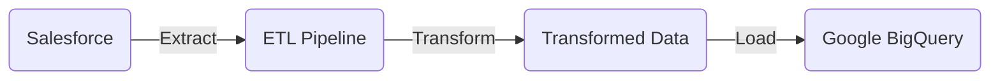
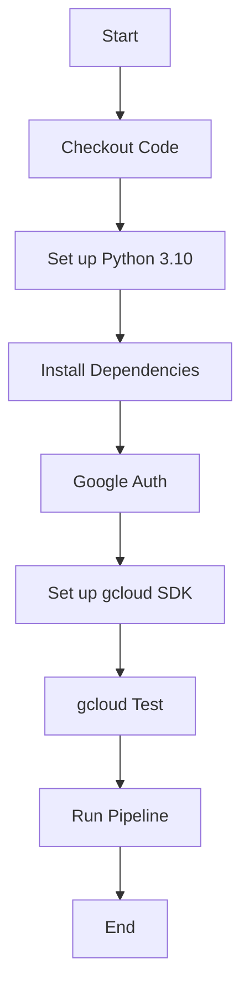

# Hired Salesforce ETL

## Overview

This is an ETL (Extract, Transform, Load) project focused on Salesforce data. It is intended for data engineers and analysts who need to extract Salesforce data, transform it, and load it into a Google BigQuery instance for further analysis.

## Ingested Tables

1. SFDC Account
2. SFDC Account History
3. SFDC Opportunity
4. SFDC Opportunity History
5. SFDC Contact
6. SFDC Contact History
7. SFDC Task
8. SFDC Campaign History

## Automated Workflow

### GitHub Actions Workflow: Load Data into Google BigQuery

### Overview

This section describes the GitHub Actions workflow that automates the running of the ETL pipeline in Google BigQuery (GBQ). This is particularly useful for production setups where data pipelines need to run on a schedule.

### Workflow Details

- **Name**: Run Data Pipelines to load data into Google BigQuery
- **Trigger**: Scheduled to run every day at 5:00 AM
- **Platform**: Runs on the latest Ubuntu version

#### Jobs and Steps

1. **Checkout Code**: Pulls the latest version of the codebase.
2. **Set up Python 3.10**: Initializes a Python 3.10 environment.
3. **Install Dependencies**: Installs all the required Python packages.
4. **Google Auth**: Authenticates against Google services.
5. **Set up gcloud SDK**: Installs Google Cloud SDK.
6. **gcloud Test**: Lists all Google Cloud services to test the setup.
7. **Run Pipeline**: Executes the main ETL script `src/salesforce.py`.

### How It Integrates with the ETL

This workflow serves as the automated trigger for the ETL pipeline. Once activated, it ensures that the pipeline is executed daily, extracting new data from Salesforce and loading it into Google BigQuery.

## How to Use

### Pre-requisites

- Python 3.x
- Salesforce API Access
- Google BigQuery Access
- Poetry