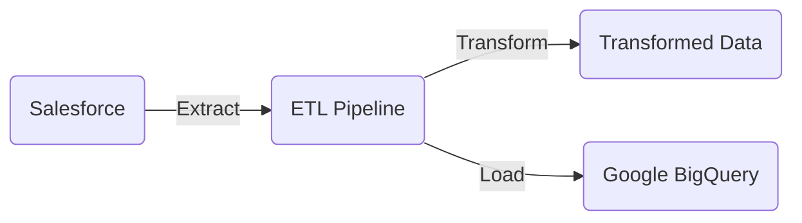

# Hired Salesforce ETL

## Overview

This is an ETL (Extract, Transform, Load) project focused on Salesforce data. It is intended for data engineers and analysts who need to extract Salesforce data, transform it, and load it into a Google BigQuery instance for further analysis.

## Ingested Tables

1. SFDC Account
2. SFDC Account History
3. SFDC Opportunity
4. SFDC Opportunity History
5. SFDC Contact
6. SFDC Contact History
7. SFDC Task
8. SFDC Campaign History

## How to Use

### Pre-requisites

- Python 3.x
- Salesforce API Access
- Google BigQuery Access
- Poetry